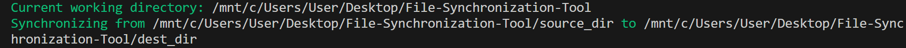
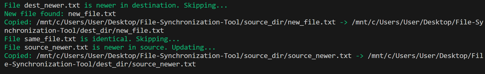

  


# File Synchronization Tool 🗂️  

🔧 Command-line utility in C for efficient file synchronization between source and destination folders 

## Table of Contents  

1. [About](#about)  
2. [Features](#features)  
3. [Requirements](#requirements)  
4. [Installation](#installation)  
5. [Usage](#usage)  

---

## About

The **File Synchronization Tool** is a lightweight C program that synchronizes files between a source and destination directory.  
It keeps both folders consistent by comparing and updating their contents automatically.  
The project demonstrates system-level programming concepts such as **process creation (fork)** and **program execution (exec)** to perform file operations efficiently.

---

## Features  

- Synchronizes files between source and destination directories  
- Detects and handles new files  
- Detects and handles files that are newer in source or destination  
- Skips files that are identical  
- Copies updated or new files automatically  

---

## Requirements

- A Linux, macOS, or Windows system with WSL for running C programs  
- GCC (GNU Compiler Collection) or another C compiler  
- Git (to clone the repository)  
 
---

## Installation

Follow these steps to set up the project locally:

---

### 1. Clone the repository
```bash
git clone https://github.com/Amit-Bruhim/File-Synchronization-Tool.git
```

### 2. Compile the program
```bash
gcc -o file_sync file_sync.c
```

### 3. Run the program

Make sure to provide the required arguments: a source directory and a destination directory.

```bash
./file_sync <source_directory> <destination_directory>
```

---

## Usage

When you run the program, it will first print an opening message showing the current working directory and the source/destination directories being synchronized:  



Then, it will process each file individually, printing messages depending on the file's status.  
For demonstration, we will use a classic example of two folders containing one file of each type: new, identical-new, identical-old, same content, etc.  



When synchronization completes, a final message will be displayed:  


> **Note:** Issues such as missing directories or missing command-line arguments will result in an error message.

For user convenience, the `source_dir` and `dest_dir` folders are already prepared with example files so you can test the synchronization immediately.  

- `source_dir` contains the original files to be synchronized:  
  - `dest_newer.txt` – older version compared to destination  
  - `new_file.txt` – file that exists only in source  
  - `same_file.txt` – identical file in both folders  
  - `source_newer.txt` – newer version compared to destination  

- `dest_dir` contains the destination files:  
  - `dest_newer.txt` – newer version compared to source  
  - `new_file.txt` – will be created during synchronization  
  - `same_file.txt` – identical file in both folders  
  - `source_newer.txt` – older version compared to source  

To test the program, run the following command:

```bash
./file_sync source_dir dest_dir
```
